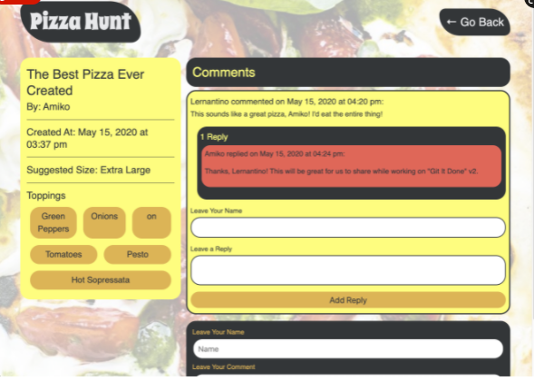

# pizza-hunt
Module 18: NoSQL

## Purpose
Build Pizza Hunt, a social media recipe app where users can post their creative spins on pizza, add comments to recipes, and create threads within comments. 
Add back-end functionality to an existing front end.

## Built With
* MongoDB
* Mongoose
* JavaScripts
* Git Hub

## Contribution
Made with ❤️ by Samantha Malone
Shout out to my tutor
© 2021 Samantha Malone. All rights reserved.
